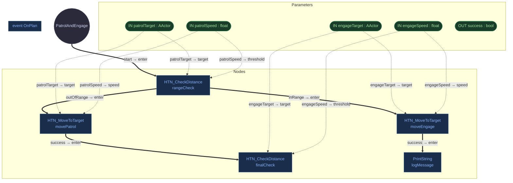

## PatrolAndEngage : HTNGraph

```mermaid
flowchart TD
    classDef param fill:#1a3d2a,stroke:#4a9a6a,color:#a6e3a1
    classDef node fill:#1a2d4a,stroke:#4a7a9a,color:#89b4fa
    classDef ctx fill:#2a2a3a,stroke:#6c7086,color:#cdd6f4

    context(("PatrolAndEngage")):::ctx

    subgraph params["Parameters"]
        direction TB
        patrolTarget(["IN patrolTarget : AActor"]):::param
        engageTarget(["IN engageTarget : AActor"]):::param
        patrolSpeed(["IN patrolSpeed : float"]):::param
        engageSpeed(["IN engageSpeed : float"]):::param
        success(["OUT success : bool"]):::param
    end

    subgraph nodes["Nodes"]
        direction TB
        rangeCheck["HTN_CheckDistance\nrangeCheck"]:::node
        movePatrol["HTN_MoveToTarget\nmovePatrol"]:::node
        moveEngage["HTN_MoveToTarget\nmoveEngage"]:::node
        finalCheck["HTN_CheckDistance\nfinalCheck"]:::node
        logMessage["PrintString\nlogMessage"]:::node
    end

    subgraph OnPlan["event OnPlan"]
        direction LR
    end
    context ==>|"start → enter"| rangeCheck
    rangeCheck ==>|"inRange → enter"| moveEngage
    rangeCheck ==>|"outOfRange → enter"| movePatrol
    moveEngage ==>|"success → enter"| logMessage
    movePatrol ==>|"success → enter"| finalCheck
    patrolTarget -.->|"patrolTarget → target"| rangeCheck
    patrolSpeed -.->|"patrolSpeed → threshold"| rangeCheck
    patrolTarget -.->|"patrolTarget → target"| movePatrol
    patrolSpeed -.->|"patrolSpeed → speed"| movePatrol
    engageTarget -.->|"engageTarget → target"| moveEngage
    engageSpeed -.->|"engageSpeed → speed"| moveEngage
    engageTarget -.->|"engageTarget → target"| finalCheck
    engageSpeed -.->|"engageSpeed → threshold"| finalCheck
```
